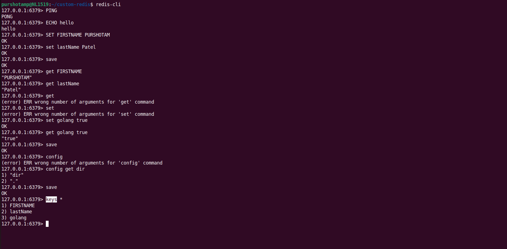
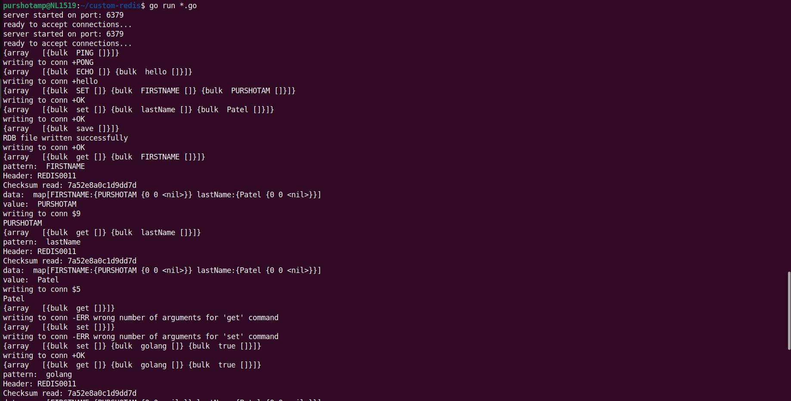
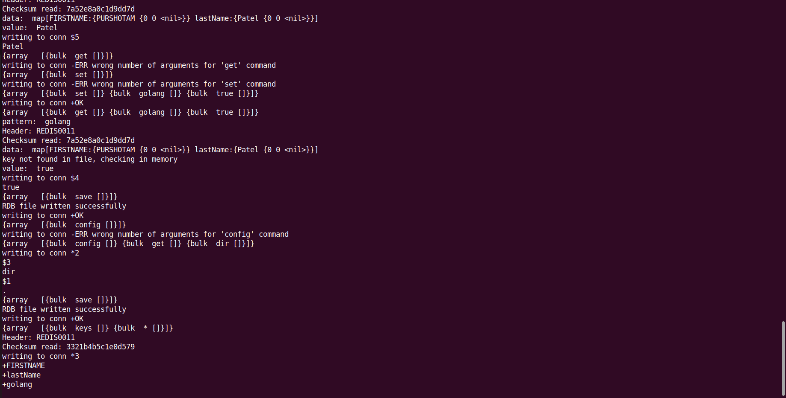

## Custom Redis in Go By Purshotam

This is a simple implementation of a Redis-like server written in Go, supporting a set of basic commands with both uppercase and lowercase variations.

## Supported Commands
- **PING** / **ping**: Test the server connection.
- **ECHO** / **echo**: Echo back the provided message.
- **SET** / **set**: Set a key-value pair.
- **GET** / **get**: Get the value associated with a key.
- **SAVE** / **save**: Save data to disk (example command, may vary in real use).
- **CONFIG** / **config**: Get or set configuration parameters.
- **KEYS** / **keys**: Retrieve all keys stored in the server.

Provide Error handling for wrong commands and wrong number of arguments . 

Related Images:

For Setting up the project follow the steps below:

Prerequisites:
- Go installed

Steps:
- Clone the repository
- Run the project using `go run *.go`
- Use `redis-cli` to connect to the server and test the commands

Feel free to contribute to the project pull requests are welcome

